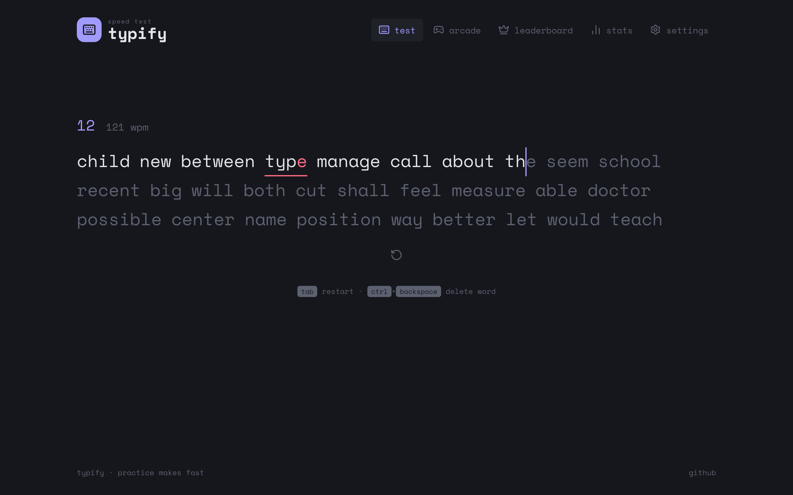
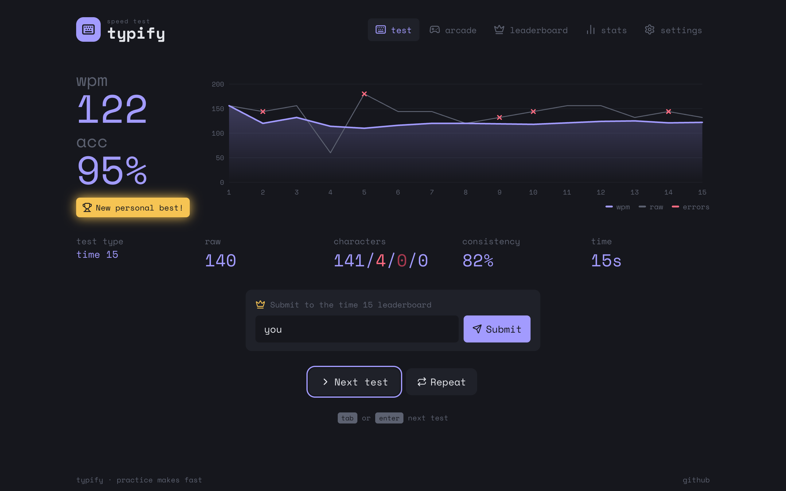
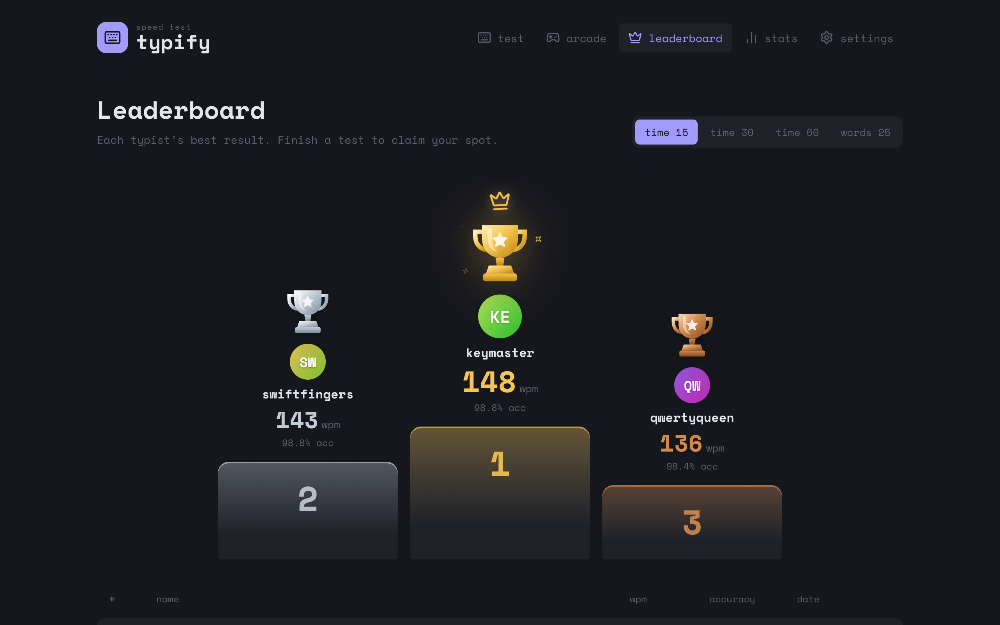

<div align="center">

# ⌨️ Typify

**A fast, minimal typing speed test, with a leaderboard, stats, themes and an arcade mode.**

**[▶ Try it live](https://typify-1rjv.onrender.com)**

[](https://nextjs.org)
[](https://react.dev)
[](https://www.typescriptlang.org)
[](https://sass-lang.com)
[](https://zustand.docs.pmnd.rs)
[](https://pnpm.io)
[](LICENSE)
<br />
[](https://github.com/boushib/typify/commits/main)
[](https://github.com/boushib/typify)
[](https://github.com/boushib/typify)



</div>

## Screenshots

**Results:** WPM, accuracy and a speed chart with error markers



**Leaderboard:** a trophy podium for the top three



## About

Typify measures your typing speed and accuracy. It's built with **Next.js 16** (App Router), **React 19** and **TypeScript**.

Everything is saved in your browser: settings, results, personal bests and the leaderboard (a field of demo players plus the scores you submit). There's no server, so it's a static site that runs on any host.

## Features

### Typing test
- **Modes:** time (15, 30, 60, 120 s), words (10, 25, 50, 100) and quote, with optional punctuation and numbers
- A smooth caret (line, block or underline), letter-by-letter coloring, mistyped words underlined, and three visible lines that scroll as you type
- Backspace into a word with a mistake, <kbd>Ctrl</kbd>+<kbd>Backspace</kbd> to delete a word, <kbd>Tab</kbd> to restart
- Live countdown (or word count) and live WPM, plus a Caps Lock warning
- Works with phone keyboards: input goes through a hidden text field

### Results
- WPM, accuracy, raw WPM, consistency, a character breakdown (correct, incorrect, extra, missed) and test length
- A chart of WPM and raw speed per second, with markers where mistakes happened
- A "new personal best" badge
- Results under 1 second or over 350 WPM are marked invalid and not saved

### Leaderboard
- Boards for time 15, 30 and 60, and words 25, showing each typist's best result
- A podium for the top three, with gold, silver and bronze trophies; the ranked list follows below
- Submit a result from the results screen and see your rank; your rows are highlighted

### Stats
- Tests completed, time spent typing, highest WPM, and recent average WPM and accuracy
- A progress chart with a 10-test moving average
- Personal bests for every time and word count, plus a table of recent tests

### Letter Rush (arcade)
- The original Typify game: type the letter shown, as many as you can in 30 seconds
- A combo multiplier (up to x5), a shake on misses, floating points, a next-letter preview and a saved best score

### Settings
- **Themes:** eight color themes (Midnight, Paper, Ocean, Forest, Sunset, Latte, Mono, Matrix), applied before first paint so the page never flashes the wrong colors
- Caret style, smooth caret, key click sounds (synthesized, no audio files), live WPM, font size and your leaderboard name

The app also works on phones, and respects the OS "reduce motion" setting.

## Getting started

Requires Node.js 20.9+ and pnpm.

```bash
pnpm install
pnpm dev
```

Open [http://localhost:3000](http://localhost:3000).

| Script | What it does |
| --- | --- |
| `pnpm dev` | Dev server with Turbopack |
| `pnpm build` | Static build of the whole site in `out/` |
| `pnpm lint` | ESLint (flat config) |
| `pnpm typecheck` | TypeScript, no emit |
| `pnpm dev:agent` / `pnpm build:agent` | The same on port 3400, with a separate `.next-agent` output, so a second server doesn't clash with yours |

## Leaderboard

The leaderboard lives in your browser: seeded demo players plus the scores you submit, saved in localStorage. Each player's best result per test type is ranked. Names must be 2–20 letters, digits, dots, dashes or underscores, and scores above 300 WPM are rejected. To share it between players, swap `src/lib/scores.ts` for calls to a real backend.

## Project structure

```
src/
  app/                 Routes: / (test), /arcade, /leaderboard, /stats, /settings
  components/          Typing test, navbar, trophy, app shell
  views/               One folder per page
  lib/                 Test engine and stats, words, quotes, themes, sound, and the leaderboard (scores.ts)
  store/               Settings, results history and best scores (zustand, saved to localStorage)
```

**How WPM is calculated:** every five correctly typed characters count as one word. A word counts only if it's typed correctly, and then its trailing space counts too. **Raw WPM** counts every keystroke. **Consistency** measures how steady your per-second speed is.

## License

[MIT](LICENSE) © El Hassane Boushib
